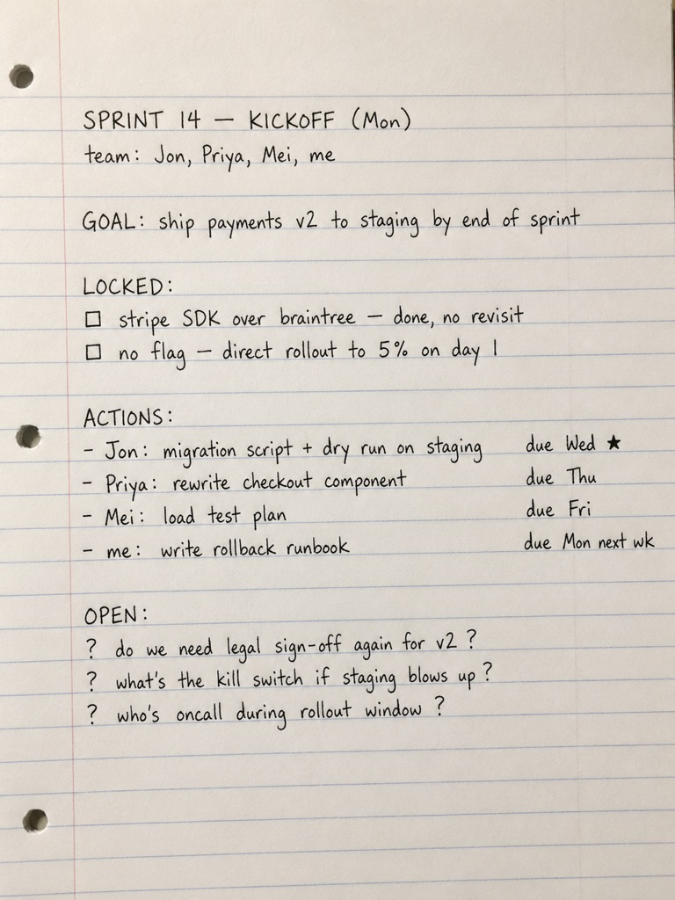
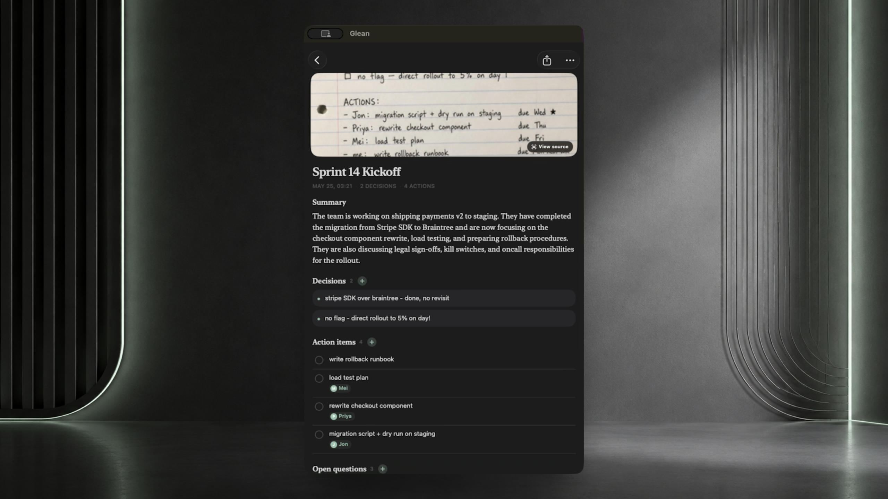
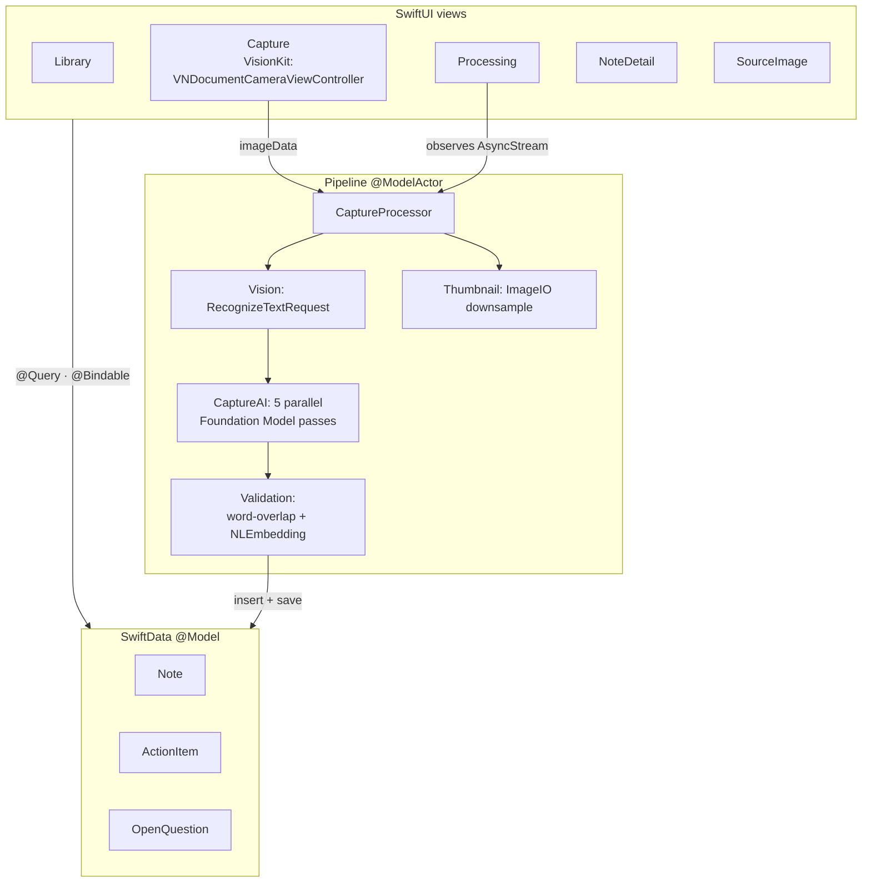
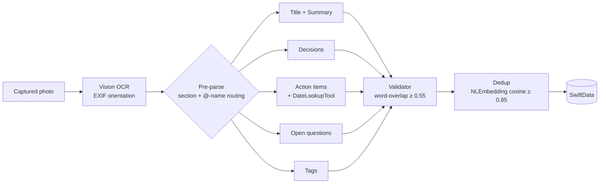

# Glean

> **Glean uses Apple Intelligence to turn handwritten pages into structured notes.**
>
> Snap a page. Five parallel Foundation Model passes extract decisions, action items, open questions, and tags. Everything runs on the phone.
>
> No cloud.  
> No API keys.  
> No data leaves the device.

<table align="center">
  <tr>
    <td align="center"><strong>Before</strong></td>
    <td align="center"><strong>After</strong></td>
  </tr>
  <tr>
    <td align="center" valign="top">
      
    </td>
    <td align="center" valign="top">
      
    </td>
  </tr>
</table>

A handwritten page, captured and parsed by Glean on-device.

Lecture notes, whiteboards, sticky-note walls, the back of a napkin. Glean
reads them with on-device Apple Intelligence and saves each capture as a
structured note: summary, decisions, action items, open questions, tags.
Nothing leaves the device.

**Status:** in development. App Store submission planned.

---

## Demo

https://github.com/user-attachments/assets/3c1ed9ff-2aad-417e-95fe-39314b670718

A full capture, from photo to saved note.

---

## Highlights

- **Apple Intelligence, parallelized.** Glean runs five Foundation Model
  passes concurrently on the device, one per output field. Tuned around
  the 3B model's accuracy limits on multi-field output.

- **A deterministic safety net.** Every model output is filtered by
  word-overlap against the source text and `NLEmbedding`-based
  near-duplicate detection before reaching storage. Hallucinations don't
  ship.

- **A measured image pipeline.** Thumbnails decode through
  `CGImageSourceCreateThumbnailAtIndex` inside `autoreleasepool` brackets.
  A 20-note library stays under 30 MB resident.

- **Zero network, photo to saved note.** OCR, parsing, dedup, storage. All
  on the phone.

- **Native iOS 26.** Pure SwiftUI, SwiftData, Liquid Glass, Foundation
  Models, Vision, NaturalLanguage. No third-party dependencies.

---

## The app

**Library.** Search, sort, pin, swipe to delete. Multi-select edit mode for
bulk pin or delete. Pinned notes stay at the top.

**Note detail.** Every field is editable in place. Action items open a
focused editor with date and urgency. Questions can be answered inline.

**Source viewer.** Pinch-zoom up to 4×. Share or save to Photos.

---

## Architecture

Views never reach into the pipeline. The capture flow hands `imageData` to
a `@ModelActor` `CaptureProcessor`. The actor streams `ProcessingEvent`s
back via `AsyncStream` for `ProcessingView` to render phase transitions.
When it finishes, it inserts the assembled `Note` plus child `ActionItem`s
and `OpenQuestion`s in a single autoreleasepool-wrapped commit.

## The pipeline

A deterministic pre-parse routes each generation to the relevant section of
the OCR (text under `DECIDED:` for decisions, `TODO:` for actions, and so
on) and attaches an `@-name` constraint to the actions pass when explicit
owners are present. On devices without Apple Intelligence, the pipeline
falls back to plain OCR and surfaces a "Plain OCR" badge on the note.

---

## Tech stack

SwiftUI · SwiftData · Foundation Models · Vision · VisionKit ·
NaturalLanguage · ImageIO · iOS 26 · Liquid Glass

No third-party dependencies.

---

## Privacy

- Notes never leave the device. No server, no cloud LLM fallback, no
  analytics, no crash reporting to third parties.
- No accounts. No identifier tied to you.
- Storage is local: SwiftData (SQLite plus external-storage blobs) in the
  app's Application Support directory.

---

## Roadmap

- **Tasks view.** Aggregate action items across all notes into a sorted,
  filterable list (by owner, due date, urgency).
- **Multi-page notes.** Capture and store a multi-page scan as a single
  note instead of taking only the first page.
- **iPad and macOS.** Multi-column layouts. macOS via Designed-for-iPad
  initially, native Catalyst later.
- **iCloud sync via CloudKit.** End-to-end encrypted, Apple-ID-based, zero
  third-party identity. Preserves the on-device-first promise.
- **Share extension and Shortcuts.** Capture from any app, automate via
  Siri.

---

## Requirements

- iPhone with Apple Intelligence support for full structured extraction.
  Older devices fall back to plain-OCR mode.
- iOS 26.0+
- Xcode 16.0+ to build.

---

## License

All rights reserved. See [LICENSE](LICENSE).
